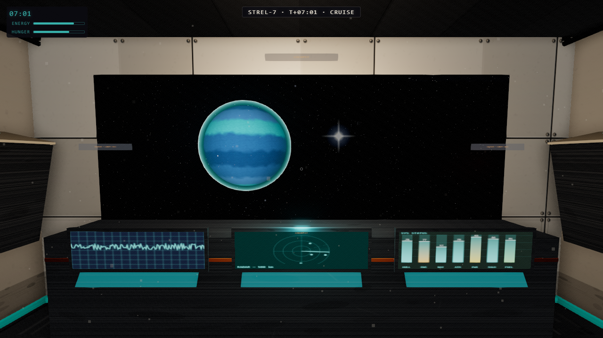
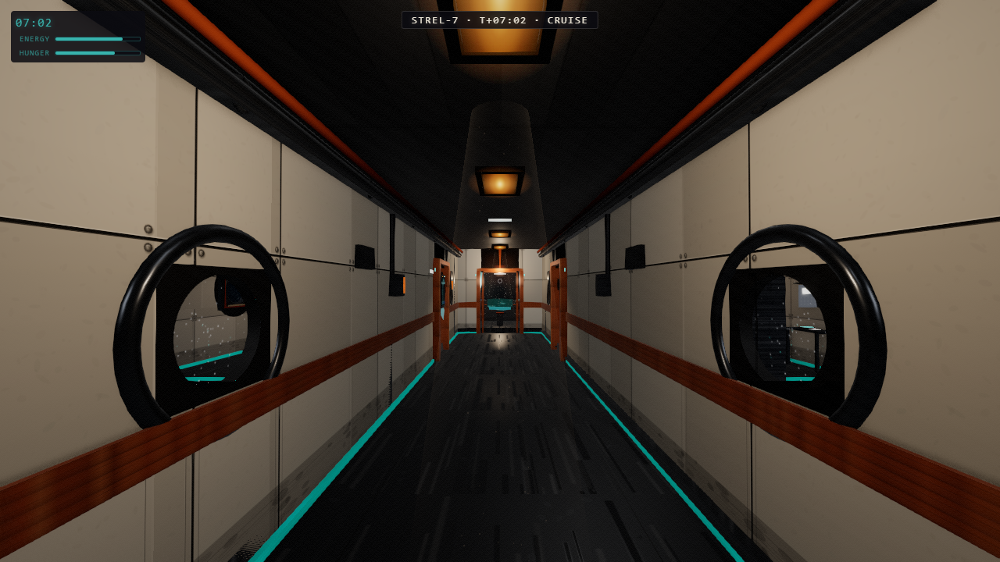
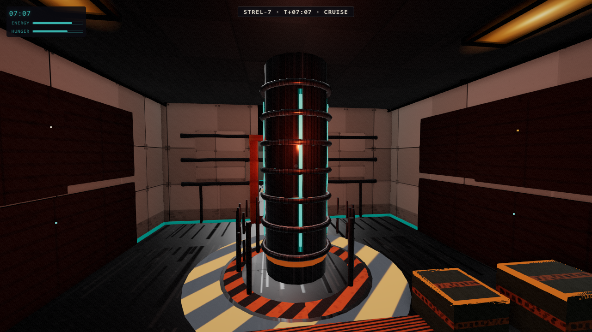
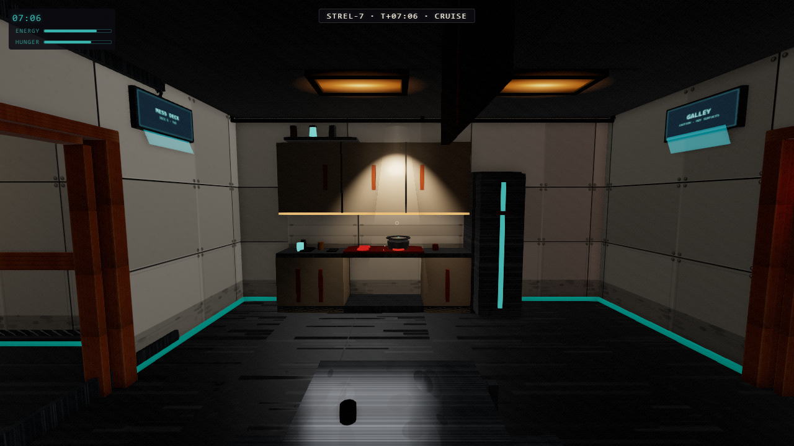
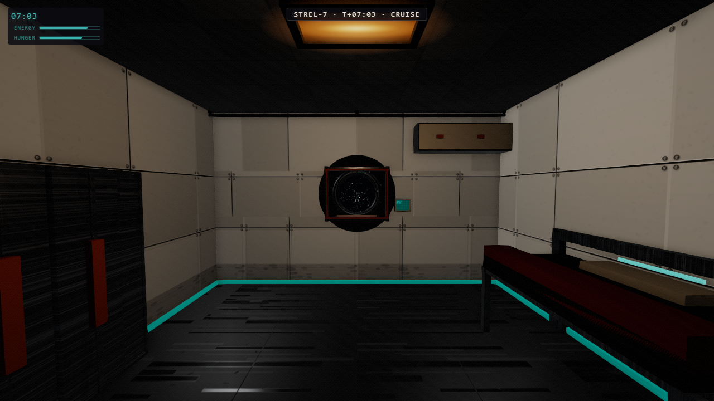
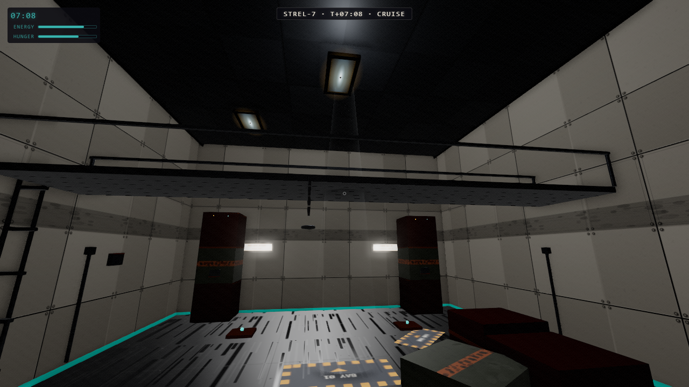

# Starship Explorer

A first-person walkable starship built entirely in Three.js — no external assets, no frameworks. Every surface is procedurally generated at runtime: panel textures, grime overlays, emissive teal strips, animated console screens. The aesthetic is a worn industrial freighter lifted from *Alien* (1979) and rendered with ACES filmic tone-mapping, PBR materials with sRGB-honest 2K procedural textures, GTAO contact shadows, SMAA, filmic grain, and cinematic pooled lighting — warm fixture pools with real falloff, fixture halation, volumetric light shafts with drifting dust motes, and a reactor that breathes (v0.9 "RADIANCE").

Outside the windows the ship is on a **Living Cruise**: a seeded encounter director streams a two-layer parallax starfield past the hull and schedules a rolling cast of procedurally-painted planets, moons, asteroid fields, and rare events (comets, nebulae, derelicts) — all named, all scannable from the cockpit console. Two persistent deep-field **nebula sprites** (teal and rust-red, additive, opacity 0.07-0.09) give space permanent color depth. Portholes are framed by thick **round bezels** — PBR gunmetal torus rings with bolt heads and cylindrical reveal tubes, matching the reference ship's porthole design.

And the ship **flies** (v1.1 "SOVEREIGN"): take the port cockpit seat, grab the virtual stick, and steer the whole universe — the hull is pinned at the origin while a universe rig counter-rotates space around it. A chase camera reveals the full exterior hull with throttle-keyed engine plumes; an approach assist flies you to a seeded destination planet and parks you at proximity hold. From there (v1.2 "LANDFALL") press **L** and ride a cinematic atmosphere entry — heat glow, turbulence, cloud punch-through — down to a **streamed procedural desert planet**: kilometers of terraced mesas under a fog-matched sky, boulder fields and rock spires, roaming dune-strider herds and ridge gliders (scannable into the codex), an optional storm system with rain and lightning, and your own ship parked on the scorched landing pad. Walk out, explore, board the hatch, and you're back at hold — the whole loop repeatable, and the entire planet costs nothing measurable against the frame budget.

---

## Screenshots













---

## Controls

| Key / Action | Effect |
|---|---|
| `W A S D` | Move forward / left / backward / right |
| Mouse (after click) | Look around (pointer-lock) |
| `E` | Interact with highlighted object (take the helm from the port cockpit seat) |
| `W/S` + mouse (at helm) | Throttle and steer; `Shift` boost, `X` all-stop, `A/D` roll trim |
| `V` (at helm) | Toggle the exterior chase camera |
| `F` (at helm) | Approach assist — autopilot to the destination planet |
| `L` (at proximity hold) | **Land** — descend to the planet surface and walk |
| `` ` `` (backquote) | Toggle debug overlay (fps / draw calls / position) |

---

## Quickstart

```bash
npm install
npm run dev
```

Open `http://localhost:5173` in a browser. Click the canvas to capture the mouse.

URL flags:

- `?bloom=0` — disable post-processing bloom (maximum performance).
- `?quality=high` — enable the high-quality path: SSAO contact shadows plus PCF-soft SpotLight shadow maps on the corridor junction and reactor lights. Costs a few ms; **off by default and a strict no-op when absent** (the verify budget is unaffected).
- `?quality=low` — disable all shadow casting entirely (maximum compatibility / battery mode).

---

## Commands

| Command | Description |
|---|---|
| `npm run dev` | Vite dev server with HMR |
| `npm run build` | Production build to `dist/` |
| `npm run typecheck` | `tsc --noEmit` — must be clean before verify |
| `npm run verify` | Headless Playwright: build, screenshot every camera, run all functional tests, write `verify/report.json` |
| `npm run verify:headed` | Same harness, headed Chromium with GPU — fps numbers here are authoritative |
| `node scripts/capture.mjs` | Records a ~40s showcase video tour to `verify/capture/showcase.webm` |

---

## Architecture

```
src/
  core/
    cameras.ts      — Named-camera registry; window.__setCam(name) teleport
    perf.ts         — Rolling fps tracker, p95 frame time, window.__perf.sample()
    state.ts        — Ship state: accelerated clock, energy and hunger bars
  world/
    assembly.ts     — Positions all rooms, registers lights and space environment
    cockpit.ts      — Forward command room with canopy window cutout
    corridor.ts     — Central spine connecting fore to aft
    quarters.ts     — Port and starboard crew cabins (A + B)
    galley.ts       — Mess / kitchen with interactive stove
    engineering.ts  — Aft reactor room with pulsing column
    roomBuilder.ts  — Shared wall/floor/ceiling panel geometry helpers
    roomDressing.ts — Shared prop factories (crates, vents, strips)
    materials.ts    — Shared MeshStandardMaterial instances
    types.ts        — AABB, Interactable, RoomModule interfaces
  player/
    controller.ts   — WASD + PointerLockControls, capsule collision, isMoving()
    interact.ts     — Centre-screen raycaster, E-key trigger, headless fallback
  fx/
    textures.ts     — Procedural CanvasTexture generators (panels, grime, hazard)
    texturesEmissive.ts — Emissive teal strip and ceiling panel textures
    textureHelpers.ts   — Canvas drawing utilities
    shipMaterials.ts    — Emissive material factories reused across rooms
    starfield.ts    — NEAR streaming parallax star layer (one draw call)
    planet.ts       — Thin PlanetResult adapter over the v0.4 SpaceDirector
    space/          — 'Living Cruise' flight system (see below)
      director.ts     — Encounter director: seeded scheduler + master tick + scan API
      starLayer.ts    — GPU-streamed star layer (shared NEAR + FAR)
      cast.ts         — Rolling cast entries: spawn geometry, motion, despawn
      bodies.ts       — Procedural body factory (gas giant / rocky / ice / lava / ringed / moon)
      bodyTextures.ts — Per-body CanvasTextures with baked day/night terminator
      asteroids.ts    — One InstancedMesh asteroid field (one draw call)
      events.ts       — Rare events: comet, nebula sprite, derelict satellite
      palette.ts      — Hue families + shared space palette
      names.ts        — Seeded catalogue-name generator
      rng.ts          — Deterministic mulberry32 PRNG
    sway.ts         — Barely-perceptible ±0.2° camera roll oscillation
    audio.ts        — WebAudio synthesis: engine hum + footsteps (zero files)
    bloom.ts        — UnrealBloomPass + optional SSAO (?quality=high); ?bloom=0 kills bloom
  ui/
    hud.ts          — DOM HUD: ship clock, energy/hunger bars, interaction prompt
    debug.ts        — Backquote debug overlay (fps, draw calls, triangles, position)
scripts/
  verify.mjs        — Playwright verification harness (screenshots + perf + functional tests)
```

---

## Performance Budget

| Metric | Budget | v0.4 (headless, worst camera) |
|---|---|---|
| Draw calls | ≤ 300 | 144 |
| Triangles | ≤ 500 k | ~4.9 k |

Headed runs with a real GPU report the authoritative fps (`npm run verify:headed`); headless fps numbers are not meaningful. The verify harness samples perf from the worst-case camera and records it as `perfCamera` in `report.json`. Flags: `?bloom=0` disables post-processing; `?quality=high` adds SSAO + shadows (off by default).

---

## Interactions

Everything below is on `E` (prompts appear when you look at something within reach):

- **Sleep** — bunks in either crew quarters. Fade to black, clock +8h, energy restored. Restocks the fridge.
- **Eat / Take Ration** — cook at the galley stove, or open the fridge (hinged door, 3 rations per cycle).
- **Drink Coffee** — the teal cup on the galley counter. Energy +15.
- **Sit** — pilot seats (canopy view) and galley mess benches. `E` again to stand.
- **Doors** — all six room doors slide and toggle open/closed.
- **Access Console** — the cockpit console bank cycles NAV / SYSTEMS / PLANET SCAN overlay modes. PLANET SCAN reads the live nearest body from the flight director: name, class, composition, and range in km (or `NO CONTACT — DEEP FIELD` when nothing is in range).
- **Read** — crew-log datapads in both quarters; a cargo manifest in engineering.
- **Access Panel** — the engineering breaker cabinet offers coolant venting and reactor boosts (number keys).
- **Open Locker** — one locker per quarters swings open.
- **Save Log** — the corridor save terminal persists your clock/energy/hunger to localStorage.
- And one crate in engineering that the maintenance log says you should *not* move.

The ship clock runs at 1 real-second = 1 ship-minute and is displayed in the top-left HUD, along with energy/hunger bars. A **flight status strip** at the top-center shows `STREL-7 · T+HH:MM · CRUISE` in the HUD visual language (monospace, cream, letter-spaced), updating live from the ship clock. Walking changes footstep sound by deck surface, each room has its own ambient bed, and the room name toasts as you cross thresholds.

---

## Audio

All sounds are synthesised at runtime via the Web Audio API — no audio files.

- **Engine hum**: white noise passed through a 90 Hz bandpass filter, layered with a 58 Hz sine sub-oscillator, modulated by a slow 0.08 Hz LFO for organic breathing.
- **Footsteps**: short filtered-noise bursts (55 ms, ~700 Hz LPF) fired at a randomised 420–540 ms cadence whenever the player is walking. Playback-rate jitter prevents mechanical repetition.

AudioContext starts suspended and only resumes on the first click or keydown (browser autoplay policy). The game and `npm run verify` work correctly with audio blocked.

---

## Flight system — "Living Cruise"

The whole space environment is driven through a single call (`ship.planet.tick(elapsed)`) from the render loop. Under that adapter sits the **SpaceDirector** (`fx/space/director.ts`), seeded for deterministic verify screenshots.

- **Streaming parallax starfield** — two GPU-streamed `THREE.Points` layers (one draw call each). The NEAR layer flows aft at cruise speed; the FAR shell scrolls at 25% for depth parallax. Stars wrap in the vertex shader, so there is zero per-star CPU work.
- **Encounter director** — a seeded soft-timeline scheduler maintains a rolling cast: heroes (radius 60–140), ambient bodies at the window edges, one asteroid field, and at most one rare event (comet / nebula / derelict) at a time. Everything streams aft and self-disposes past the despawn boundary.
- **Named, painted bodies** — each body is a self-contained group with its own `CanvasTexture`, slow self-spin, and a catalogue name (e.g. `OORT-339 / d`). Textures bake a **seeded day/night terminator** so bodies read as vivid, self-lit planets rather than flat spheres. Gas giants pick from four hue families; ringed giants add a translucent ring; lava worlds get an emissive crack overlay that blooms.
- **Deterministic opening cast** — at t=0 the director pins a bright teal gas giant in the canopy (left of the COCKPIT roundel) and a moon in the starboard porthole's sightline, so the hero shots are stable run-to-run.
- **Scan API** — `getScanData()` returns the nearest visible hero (name / class / composition / distance) or `null`. Surfaced in the PLANET SCAN console mode and via `window.__test.getScan()`.

> **Material note:** space bodies use `MeshBasicMaterial` (self-lit) because there is no directional sun out in the lane — the terminator is painted into the texture. The cel-comic interior uses `MeshLambert`. For a future PBR pass, the recommended path is to add a single directional "system primary" light and switch bodies to `MeshStandardMaterial`, dropping the baked terminator in favour of real lighting; this pairs naturally with the `?quality=high` shadow path.

---

## Verification & tests

`npm run verify` runs a headless Playwright harness that builds, screenshots every named camera, samples perf from the worst-case camera, and runs **8 functional tests**:

| # | Test | Asserts |
|---|---|---|
| 1 | Sleep (bunk) | clock +8h, energy restored |
| 2 | Eat (stove) | hunger restored |
| 3 | Door toggle | open → close → open |
| 4 | Fridge ration | drained hunger +30 |
| 5 | Fridge state machine | open → ration → close cycle |
| 6 | **Door auto-close** | armed door shuts when the player walks away (`window.__test.forceDoorAutoCloseCheck()`) |
| 7 | **Scan API smoke** | `getScan()` is well-formed and non-null with the deterministic t=0 hero |
| 8 | **Quest 0→1→2→3** | panel → breaker boost → file report (`questRevealAndReadPanel()` / `questAdvanceViaBreaker()`) |

All tests and the screenshot contract must stay green, and doors must default open.
