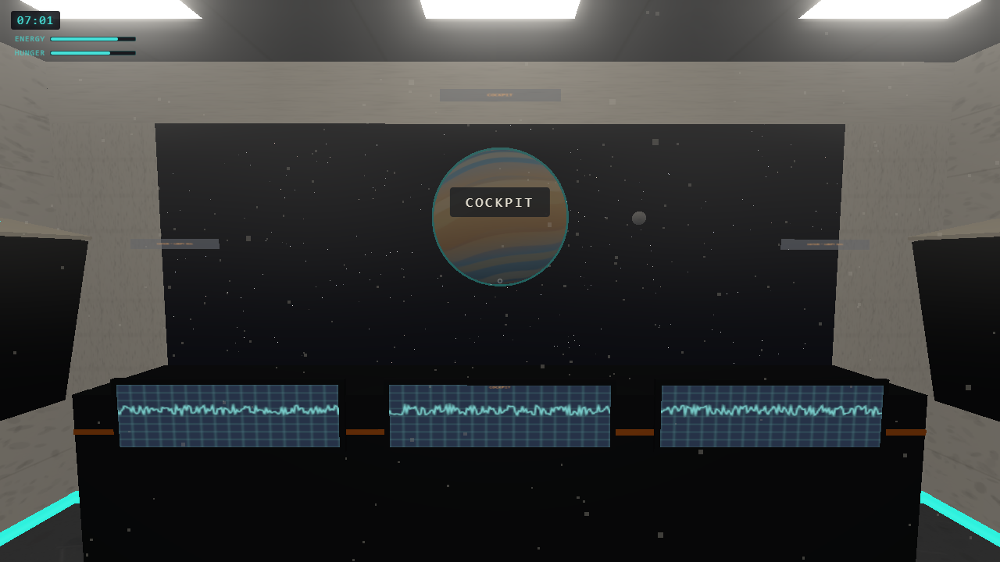
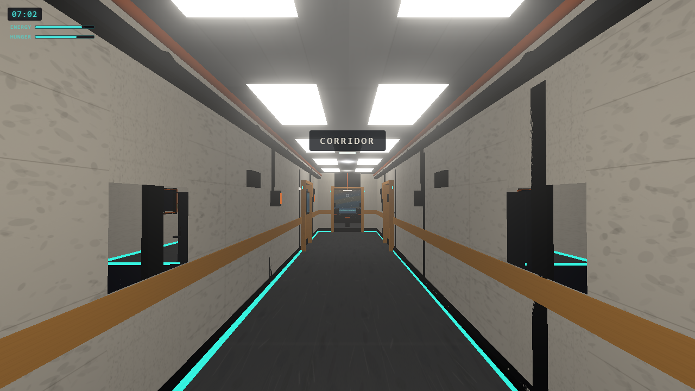
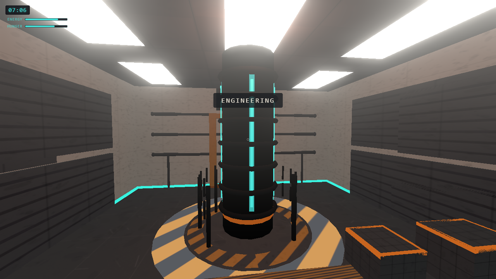
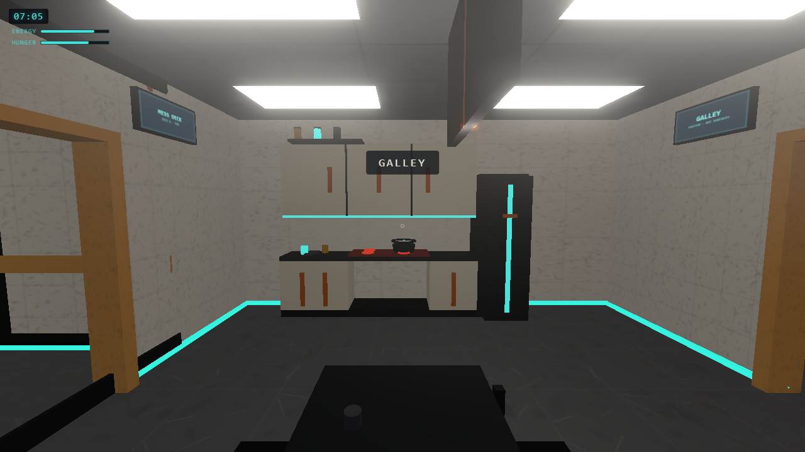
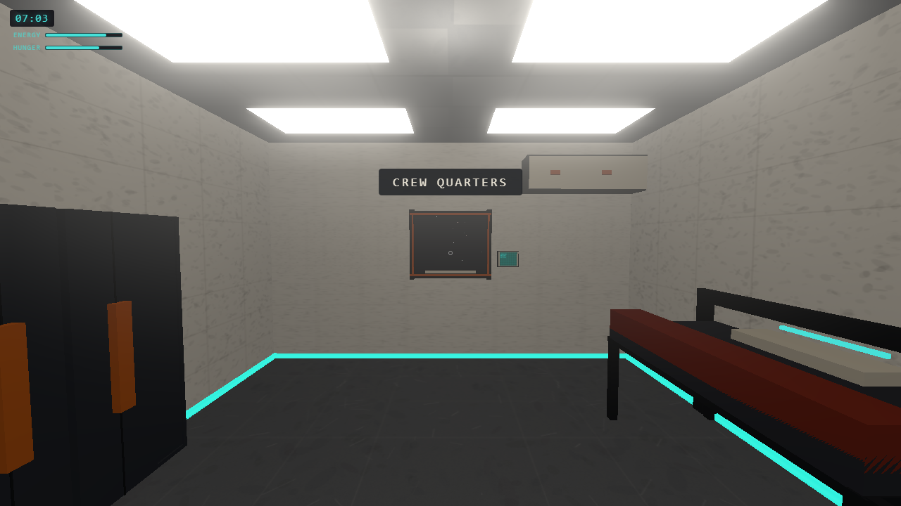
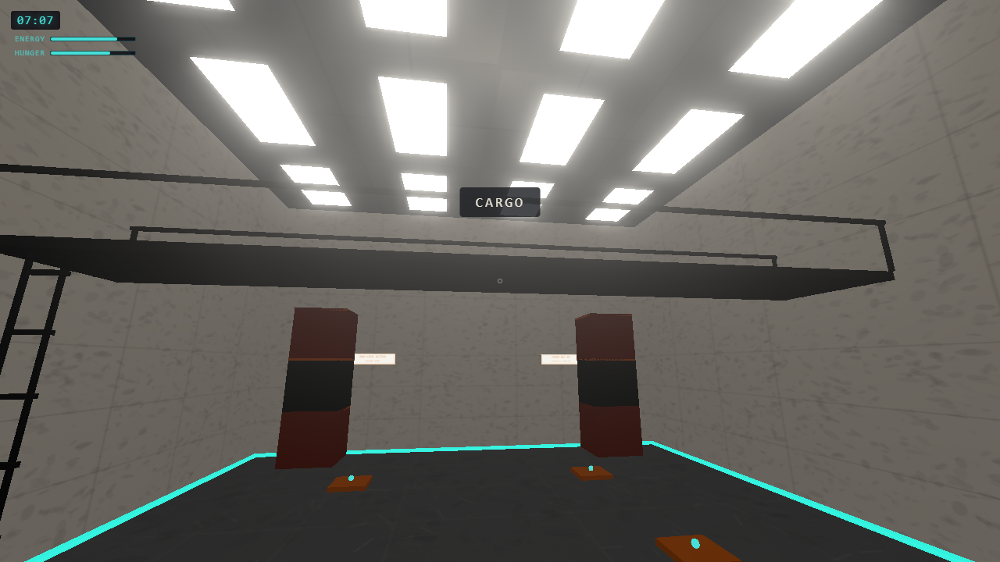

# Starship Explorer

A first-person walkable starship built entirely in Three.js — no external assets, no frameworks. Every surface is procedurally generated at runtime: panel textures, grime overlays, emissive teal strips, animated console screens. The aesthetic is a worn industrial freighter lifted from *Alien* (1979) and rendered with a flat cel-shaded comic finish.

---

## Screenshots













---

## Controls

| Key / Action | Effect |
|---|---|
| `W A S D` | Move forward / left / backward / right |
| Mouse (after click) | Look around (pointer-lock) |
| `E` | Interact with highlighted object |
| `` ` `` (backquote) | Toggle debug overlay (fps / draw calls / position) |

---

## Quickstart

```bash
npm install
npm run dev
```

Open `http://localhost:5173` in a browser. Click the canvas to capture the mouse.

Optional: add `?bloom=0` to the URL to disable post-processing bloom if you need maximum performance.

---

## Commands

| Command | Description |
|---|---|
| `npm run dev` | Vite dev server with HMR |
| `npm run build` | Production build to `dist/` |
| `npm run typecheck` | `tsc --noEmit` — must be clean before verify |
| `npm run verify` | Headless Playwright: build, screenshot every camera, write `verify/report.json` |
| `npm run verify:headed` | Same harness, headed Chromium with GPU — fps numbers here are authoritative |

---

## Architecture

```
src/
  core/
    cameras.ts      — Named-camera registry; window.__setCam(name) teleport
    perf.ts         — Rolling fps tracker, p95 frame time, window.__perf.sample()
    state.ts        — Ship state: accelerated clock, energy and hunger bars
  world/
    assembly.ts     — Positions all rooms, registers lights and space environment
    cockpit.ts      — Forward command room with canopy window cutout
    corridor.ts     — Central spine connecting fore to aft
    quarters.ts     — Port and starboard crew cabins (A + B)
    galley.ts       — Mess / kitchen with interactive stove
    engineering.ts  — Aft reactor room with pulsing column
    roomBuilder.ts  — Shared wall/floor/ceiling panel geometry helpers
    roomDressing.ts — Shared prop factories (crates, vents, strips)
    materials.ts    — Shared MeshStandardMaterial instances
    types.ts        — AABB, Interactable, RoomModule interfaces
  player/
    controller.ts   — WASD + PointerLockControls, capsule collision, isMoving()
    interact.ts     — Centre-screen raycaster, E-key trigger, headless fallback
  fx/
    textures.ts     — Procedural CanvasTexture generators (panels, grime, hazard)
    texturesEmissive.ts — Emissive teal strip and ceiling panel textures
    textureHelpers.ts   — Canvas drawing utilities
    shipMaterials.ts    — Emissive material factories reused across rooms
    starfield.ts    — THREE.Points sphere (~4 000 stars)
    planet.ts       — Gas giant with slow drift and self-rotation
    sway.ts         — Barely-perceptible ±0.2° camera roll oscillation
    audio.ts        — WebAudio synthesis: engine hum + footsteps (zero files)
    bloom.ts        — Optional UnrealBloomPass; ?bloom=0 kills it
  ui/
    hud.ts          — DOM HUD: ship clock, energy/hunger bars, interaction prompt
    debug.ts        — Backquote debug overlay (fps, draw calls, triangles, position)
scripts/
  verify.mjs        — Playwright verification harness (screenshots + perf + functional tests)
```

---

## Performance Budget

| Metric | Budget | v0.3 (headed, bloom on) |
|---|---|---|
| Average FPS | ≥ 60 | 144 |
| p95 frame time | ≤ 18 ms | 7 ms |
| Draw calls | ≤ 300 | 91 |
| Triangles | ≤ 500 k | 8 564 |

Flags: `?bloom=0` disables post-processing; `?materials=pbr` switches the material set to MeshStandard (experimental, default is the cel-comic Lambert look). The verify harness samples perf from the worst-case camera and records it as `perfCamera` in report.json.

---

## Interactions

Everything below is on `E` (prompts appear when you look at something within reach):

- **Sleep** — bunks in either crew quarters. Fade to black, clock +8h, energy restored. Restocks the fridge.
- **Eat / Take Ration** — cook at the galley stove, or open the fridge (hinged door, 3 rations per cycle).
- **Drink Coffee** — the teal cup on the galley counter. Energy +15.
- **Sit** — pilot seats (canopy view) and galley mess benches. `E` again to stand.
- **Doors** — all six room doors slide and toggle open/closed.
- **Access Console** — the cockpit console bank cycles NAV / SYSTEMS / PLANET SCAN overlay modes.
- **Read** — crew-log datapads in both quarters; a cargo manifest in engineering.
- **Access Panel** — the engineering breaker cabinet offers coolant venting and reactor boosts (number keys).
- **Open Locker** — one locker per quarters swings open.
- **Save Log** — the corridor save terminal persists your clock/energy/hunger to localStorage.
- And one crate in engineering that the maintenance log says you should *not* move.

The ship clock runs at 1 real-second = 1 ship-minute and is displayed in the top-left HUD, along with energy/hunger bars. Walking changes footstep sound by deck surface, each room has its own ambient bed, and the room name toasts as you cross thresholds.

---

## Audio

All sounds are synthesised at runtime via the Web Audio API — no audio files.

- **Engine hum**: white noise passed through a 90 Hz bandpass filter, layered with a 58 Hz sine sub-oscillator, modulated by a slow 0.08 Hz LFO for organic breathing.
- **Footsteps**: short filtered-noise bursts (55 ms, ~700 Hz LPF) fired at a randomised 420–540 ms cadence whenever the player is walking. Playback-rate jitter prevents mechanical repetition.

AudioContext starts suspended and only resumes on the first click or keydown (browser autoplay policy). The game and `npm run verify` work correctly with audio blocked.
